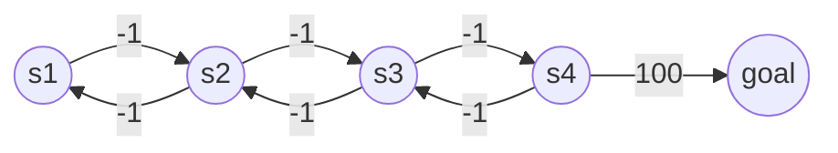
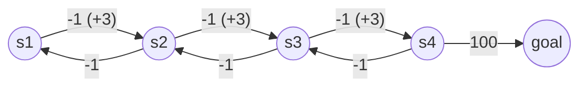
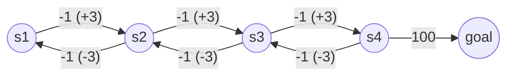

## Overview (Ibrahim et al. 2024)

[Comprehensive Overview of Reward Engineering and Shaping in Advancing Reinforcement Learning Applications](https://ieeexplore.ieee.org/abstract/document/10763475)

### Introduction

RL, a prominent subset of machine learning, trains intelligent agents to make sequential decisions by learning from interactions with their 
environment. Reward design is a critical component that significantly influences the performance and learning efficiency of RL agents.

The art of reward design can be categorized into two primary areas. 

- **Reward Engineering** 
    - [Reinforcement Learning and the Reward Engineering Principle](https://cdn.aaai.org/ocs/7704/7704-34364-1-PB.pdf)
    - Reward engineering: encompasses a broader set of techniques, including using other algorithms to design the reward function or designing reward functions from scratch.
    - The reward function must strike a balance between being informative enough to facilitate learning and sparse enough to prevent trivial solutions.
- **Reward Shaping**
    - [Theory and application of reward shaping in reinforcement learning](https://www.proquest.com/openview/bb29dc3d66eccbe7ab65560dd2c4147f/1?pq-origsite=gscholar&cbl=18750&diss=y)
    - [Learning to Utilize Shaping Rewards: A New Approach of Reward Shaping](https://proceedings.neurips.cc/paper/2020/hash/b710915795b9e9c02cf10d6d2bdb688c-Abstract.html)
    - Reward shaping is a technique inspired by animal training, involving modifying the reward function to improve the learning process without altering the optimal policy.

**Two distinct perspectives** on the nature and sufficiency of reward have emerged, sparking debate among researchers.

- [Reward is enough](https://www.sciencedirect.com/science/article/pii/S0004370221000862): Maximizing a scalar reward could be the key to understanding and further building artificial intelligence
- [Scalar reward is not enough: a response to Silver, Singh, Precup and Sutton (2021)](https://link.springer.com/article/10.1007/s10458-022-09575-5): Relying solely on a single numerical value fails to capture the multi-faceted nature of human intelligence

The **difficulties** in reward engineering:

- Reward Sparsity: Lack or delay of frequent reward signals can lead to slow learning.
- Deceptive Rewards: Reward signals may encourage the agent to find easy solutions that are not aligned with the true objective.
- Reward Hacking: Agents may exploit unintended loop-holes in the reward function to achieve high rewards without fulfilling the desired goal.
- Unintended Consequences: Reward designs can lead to unexpected and undesirable behaviors due to the complex interplay between agent actions and the environment.
- Misaligned Reward with True Objective: This highlights the crucial problem of ensuring the reward function actually incentivizes the desired behavior.
- Reward Function Complexity: A complex reward function with multiple factors can be difficult to design and interpret.
- Difficulty in Evaluating Reward Design: It can be difficult to objectively evaluate the effectiveness of a reward function, especially in complex environments.

The choice between **scalar and vector rewards** significantly impacts the agent’s learning process. 

- Scalar rewards provide a simple measure of progress towards a goal. They are computationally efficient and easy to interpret, but often fail to capture the nuances of complex tasks.
- Vector rewards utilize multiple values to represent different aspects of the task. They offer a more comprehensive evaluation, but come with the challenge of designing effective reward functions, balancing multiple objectives, and navigating the computational complexities associated with multi-dimensional feedback.

### Taxonomy

- Policy Gradient Methods (directly optimizing an agent’s policy to maximize cumulative rewards)

    - Policy Gradient for Reward Design (PGRD)

        - [Reward Design via Online Gradient Ascent](https://proceedings.neurips.cc/paper/2010/hash/168908dd3227b8358eababa07fcaf091-Abstract.html) (Sorg et al. 2010, NIPS)

        - PGRD employs online gradient ascent to iteratively adjust reward parameters during the agent’s operation.

        - "The optimal reward parameters are determined by solving the optimal reward problem."

        - $$
            \theta^* = {\arg\max}_{\theta\in\Theta} \lim_{N\rightarrow\infty}\mathbb{E}\left[
            \frac{1}{N} \sum_{t=0}^N \mathcal{R_O}(s_t)|\mathcal{R}(\cdot, \theta)
            \right]
            $$

        - $\mathcal{R_O}$ is objective reward function given by the designer.

        - Each $\theta\in\Theta$ defines a reward function $\mathcal{R}(\cdot, \theta)$.

    - Learning Intrinsic Reward for Policy Gradient (LIRPG)

        - [On Learning Intrinsic Rewards for Policy Gradient Methods](https://proceedings.neurips.cc/paper/2018/hash/51de85ddd068f0bc787691d356176df9-Abstract.html) (Zheng et al. 2018, NIPS)

        - LIRPG enables agents to dynamically learn intrinsic rewards in addition to traditional extrinsic rewards.

        - $$
            \theta^{\prime} \approx \theta+\alpha G^{e x+i n}\left(s_t, a_t\right) \nabla_\theta \log \pi_\theta\left(a_t \mid s_t\right)
            $$

        - The parameters of policy and intrinsic reward are optimized at the same time.

    - DDPG From Demonstrations (DDPGFD)

        - [Leveraging Demonstrations for Deep Reinforcement Learning on Robotics Problems with Sparse Rewards](https://arxiv.org/abs/1707.08817) (Vecerik et al. 2017, arXiv)
        - DDPGfD leverages human-provided guidance to bootstrap learning and address exploration challenges. 
        - DDPGfD integrates transitions from a human demonstrator into the replay buffer and utilizing prioritized replay to effectively sample transitions from both demonstration and agent data.
        - The learning process includes a mix of 1-step and n-step return losses to enhance performance.
        - DDPGfD updates multiple times per environment step, thereby improving learning efficiency.
        - L2 Regularization is implemented, promoting stable training and generalization.

- METHODS WITH ROBUSTNESS AND ADAPTABILITY

    - Leader-Follower Framework

        - [Robust Reward Design for Markov Decision Processes](https://arxiv.org/abs/2406.05086) (Wu et al. 2024, arXiv)

        - The leader modifies the follower’s reward function, seeking to influence their actions in the desired direction, therefore enhancing the robustness of the system.

        - [Reinforcement Learning with Perturbed Rewards](https://ojs.aaai.org/index.php/AAAI/article/view/6086) (Wang et al. 2020, AAAI)

            - Using a confusion matrix to estimate and correct noisy rewards.

            - The method involves defining unbiased surrogate rewards $\hat{r}$ based on estimated confusion matrices

            - $$
                \mathcal{Q}_{t+a}\left(s_t, a_t\right)=(1-  \left.\alpha_t\right) \mathcal{Q}\left(s_t, a_t\right)  +\alpha_t\left[\hat{r}_t+\gamma \max _{b \in \mathcal{A}} \mathcal{Q}\left(s_{t+1}, b\right)\right],
                $$

            - $\alpha\in(0,1)$ : the learning rate, will converge to the optimal Q-function as long as $\sum_t\alpha_t=\infty$ and $\sum_t\alpha_t^2<\infty$.

- EXPLORATION STRATEGIES

    - Hash-based Reward Shaping
        - [#Exploration: A Study of Count-Based Exploration for Deep Reinforcement Learning](https://proceedings.neurips.cc/paper_files/paper/2017/hash/3a20f62a0af1aa152670bab3c602feed-Abstract.html) (Tang et al. 2017, NIPS)
        - This method extends count-based exploration to high-dimensional and continuous state spaces.
        - The use of hash codes is introduced to facilitate state counting and exploration.
    - Variational Information Maximizing Exploration (VIME)
        - [VIME: Variational Information Maximizing Exploration](https://proceedings.neurips.cc/paper_files/paper/2016/hash/abd815286ba1007abfbb8415b83ae2cf-Abstract.html) (Houthooft et al. 2016, NIPS)
        - VIME is designed for continuous control tasks, focusing on maximizing the agent’s understanding of the environment’s dynamics.
        - It employs variational inference within Bayesian neural networks, enabling efficient handling of complex state and action spaces.
        - VIME encourages exploration by using information gained from the learned dynamics model as intrinsic rewards, motivating the agent to seek both external rewards and novel experiences.
    - Online Reward Shaping (Exploration-Guided Reward Shaping, EXPLORES)
        - [Exploration-Guided Reward Shaping for Reinforcement Learning under Sparse Rewards](https://proceedings.neurips.cc/paper_files/paper/2022/hash/266c0f191b04cbbbe529016d0edc847e-Abstract-Conference.html) (Devidze et al. 2022, NIPS)
            - This framework combines intrinsic reward learning with exploration-based bonuses in a fully self-supervised manner.
        - [Reward Uncertainty for Exploration in Preference-based Reinforcement Learning](https://arxiv.org/abs/2205.12401) (Liang et al. 2022, arXiv)
            - By incorporating the variance in predictions from an ensemble of reward functions optimized to align with human feedback, RUNE aims to enhance exploration in environments where learning is guided by human preferences

- Policy Parameterization

    - [Towards Generalization and Simplicity in Continuous Control](https://proceedings.neurips.cc/paper_files/paper/2017/hash/9ddb9dd5d8aee9a76bf217a2a3c54833-Abstract.html) (Rajeswaran et al. 2017, NIPS)
    - This method examines the effectiveness of simpler policy parameterizations, such as linear and Radial Basis Function (RBF) policies.

- Inverse Reward Design (IRD)

    - IRD allows RL agents to learn from expert demonstrations and deduce the underlying intention driving those actions.
    -  [A survey of inverse reinforcement learning: Challenges, methods and progress](https://www.sciencedirect.com/science/article/pii/S0004370221000515) (Arora et al. 2021, AI)
        - Inverse Reinforcement Learning (IRL) observes the states and actions of an expert, and learns a reward function that best 
            explains the behavior as the output.
        - The primary categories of IRL methods:
            - Model-Based IRL. (i.e. Maximum Entropy IRL)
            - Model-Free IRL. (i.e. Fitted IRL and Bayesian IRL)
            - Deep IRL. (i.e. deep maximum entropy IRL)
    - [Inverse Reward Design](https://proceedings.neurips.cc/paper/2017/hash/32fdab6559cdfa4f167f8c31b9199643-Abstract.html) (Hadfield-Menell et al. 2017, NIPS)
        - This approach that approximates the true reward function by treating the proxy reward as expert demonstrations. 
        - IRD aids in planning risk-averse behavior and addresses problems like misspecified rewards and reward manipulation.
        - IRD mitigates reward manipulation by treating designed rewards as observations rather than fixed objectives. 
        - IRD systems are robust to changes in high-dimensional feature spaces.

- Reward Horizon

    - [The influence of reward on the speed of reinforcement learning: An analysis of shaping](https://cdn.aaai.org/ICML/2003/ICML03-059.pdf) (Laud et al. 2003, ICML)
    - Using shaping to reduce the reward horizon guarantees learning time is polynomial relative to the size of the critical region and independent of the MDP’s size.

- Potential based Methods

    -  [Policy invariance under reward transformations: Theory and application to reward shaping](https://www.teach.cs.toronto.edu/~csc2542h/fall/material/csc2542f16_reward_shaping.pdf) (Ng et al. 1999, ICML)

        - By introducing auxiliary potentials, these methods encourage desired states and actions, leading to improved exploration and convergence.

        - $$
            R'(s,a) = R(s,a) + \gamma\Phi(s') - \Phi(s)
            $$

    - [A new potential-based reward shaping for reinforcement learning agent](https://ieeexplore.ieee.org/abstract/document/10099211/) (Badnava et al. 2023, CCWC)

        - By reinforcing reward signals based on episode rewards, they proposed the Potential-Based Reward Shaping (PBRS) method to enhance learning efficiency and performance in both single-task and multi-task environments within the Arcade learning domain

    - [Theoretical considerations of potential-based reward shaping for multi-agent systems](https://pure.york.ac.uk/portal/files/20881987/aamas11.pdf)

        - This research demonstrates that this technique maintains equivalence to Q-table initialization and does not affect the Nash Equilibria of the underlying stochastic game.
        - The study empirically reveals that potential-based shaping influences exploration, potentially leading to different converged joint policies.
        - This technique can increase the likelihood of converging to a higher global utility and reduce convergence time, potentially mitigating the risks associated with unintended cyclical policies.

    -  [Potential Based Reward Shaping for Hierarchical Reinforcement Learning.](https://www.researchgate.net/profile/Yang-Gao-153/publication/336812578_Potential_Based_Reward_Shaping_for_Hierarchical_Reinforcement_Learning/links/5db32d01299bf111d4c927dc/Potential-Based-Reward-Shaping-for-Hierarchical-Reinforcement-Learning.pdf) (Gao et al. 2015, IJCAI)

        - PBRS-MAXQ-0 merges PBRS and MAXQ within a hierarchical reinforcement learning (HRL) framework.

    - [Expressing Arbitrary Reward Functions as Potential-Based Advice](https://ojs.aaai.org/index.php/AAAI/article/view/9628) (Harutyunyan et al. 2015, AAAI)

        - This paper presents a novel framework for expressing arbitrary reward functions as potential-based advice within the context of reinforcement learning.
        - The paper primarily focuses on theoretical concepts, leaving further development of practical implementations for future research. 

    - [Reward shaping in episodic reinforcement learning](http://kar.kent.ac.uk/60614/) (Grzes et al. 2017, AAMAS)

        - It examines reward shaping in episodic tasks like games, revealing insights: potential-based shaping alters equilibria in stochastic games, introduces new equilibria with non-zero terminal state potentials, and reevaluates its role in PAC-MDP learning.

    - [Reward shaping from hybrid systems models in reinforcement learning](https://link.springer.com/chapter/10.1007/978-3-031-33170-1_8) (Qian et al. 2023, NFM)

        - To generate safety-oriented aspects of reward functions from verified hybrid systems models, this study proposed an approach of using logically constrained RL to integrate formal methods and RL. 

    - [Potential-based difference rewards for multiagent reinforcement learning](https://aamas.csc.liv.ac.uk/Proceedings/aamas2014/aamas/p165.pdf) (Devlin et al. 2014, AAMAS)

        - Difference Rewards incorporating Potential-based reward shaping (DRiP) 
        - Counterfactuals as Potential (CaP)
        - DRIP combines difference rewards, which incentivize agents to contribute to the overall system performance, with potential-based reward shaping. 
        - For applications requiring theoretical guarantees, CaP is preferred; for performance priority, DRiP is recommended, especially when domain knowledge is readily available.

- [Dynamic potential-based reward shaping](https://pure.york.ac.uk/portal/files/20881006/aamas2012.pdf) (Devlin et al. 2012, AAMAS)

    - The reward function changes over time, adapting to the current state of the agents and the environment. 

-  Upper Confidence Bound Value Iteration (UCBVI)

    - [Minimax regret bounds for reinforcement learning](https://proceedings.mlr.press/v70/azar17a) (Azar et al. 2017, ICML)
        - The UCBVI algorithm is a method for shaping rewards that extends the Value Iteration technique, ensuring that the resulting value function serves as an upper confidence bound (UCB) with a high probability on the optimal value function.
    - [Unpacking reward shaping: Understanding the benefits of reward engineering on sample complexity](https://proceedings.neurips.cc/paper_files/paper/2022/hash/6255f22349da5f2126dfc0b007075450-Abstract-Conference.html) (Gupta et al. 2022, NIPS)
        - A modified version of the UCBVI algorithm incorporates reward shaping to modify bonuses and value function projection. 

- Difference Rewards (D)

    - Difference Rewards enhance the original reward function by incorporating a difference term that measures the discrepancy between the agent’s current state and a designated reference state.
    - Individual and Difference Rewards
        - [Individual versus Difference Rewards on Reinforcement Learning for Route Choice](https://ieeexplore.ieee.org/abstract/document/6984839) (Grunitzki et al. 2014, BRACIS)
        - This work explores two reinforcement learning approaches, IQ-learning and DQ-learning. IQ-learning uses individual utility as the reward function, while DQ-learning uses a difference reward function that aims to maximize system utility.

- Knowledge-based Multi-Objective Multi-agent Reinforcement Learning (MOMARL)

    - The optimal technique for a given MOMARL application depends on specific constraints, such as the availability of system knowledge, bandwidth for communication, and the designer’s expertise.

- Plan-based Methods

    - These methods allow agents to simulate ‘‘what-if’’ scenarios and generate policy updates without causing state changes in the environment. Agents uses their imagination to explore different paths before taking real actions.
    - Utilization of Strips
        - [Plan-based reward shaping for reinforcement learning](https://ieeexplore.ieee.org/abstract/document/4670492) (Grzes et al. 2008, IS)
        - The study introduces a STRIPS-based reward shaping technique, utilizing a Stanford Research Institute Problem Solver (STRIPS) representation of actions and goals through preconditions and effects.

    - Comparing Plan-based to Abstract MDP
        - [A comparison of plan-based and abstract MDP reward shaping](https://www.tandfonline.com/doi/full/10.1080/09540091.2014.885283) (Efthymiadis et al. 2013, Connection Science)
        - This study compared two reward shaping methods: plan-based and abstract MDP. The plan-based method supplements an agent’s actions with additional rewards based on predefined plans. The abstract MDP approach involves solving a higher-level MDP to shape behavior using its value function.

- Belief Reward Shaping (BRS)

    - [Belief reward shaping in reinforcement learning](https://ojs.aaai.org/index.php/AAAI/article/view/11741) (Marom et al. 2018, AAAI)
    - Belief Reward Shaping (BRS) enhances reinforcement learning by incorporating prior knowledge about the environment’s reward structure. It augments the standard reward signal with ‘‘belief rewards’’ derived from a Bayesian framework, reflecting prior assumptions or beliefs about the distribution of rewards.

- Bi-level Optimization of Parameterized Reward Shaping (BiPaRS)

    - [Learning to utilize shaping rewards: A new approach of reward shaping](https://proceedings.neurips.cc/paper/2020/hash/b710915795b9e9c02cf10d6d2bdb688c-Abstract.html) (Hu et al. 2020, NeurIPS)
    - This framework learns to adaptively utilize shaping rewards by optimizing a parameterized weight function for the shaping reward at the upper level, while simultaneously optimizing the policy using the shaped reward at the lower level.

- Reward Shaping via Human Feedback

    - A burgeoning area of research within RL involves the integration of human preferences to leverage this feedback, guiding agents toward desired behaviors and objectives.

- Underrepresented Reward Shaping Techniques and Methods

    - Reward Shaping for Deep Q-Learning in Power Grid Cyberattack Defense
        - [Defending Smart Electrical Power Grids against Cyberattacks with Deep Q-Learning](https://journals.aps.org/prxenergy/abstract/10.1103/PRXEnergy.1.033005) (Moradi et al. 2022, PRX Energy)

- Other Methods

    - Automated Parameter Tuning
        - [Combining automated optimisation of hyperparameters and reward shape](https://arxiv.org/abs/2406.18293) (Dierkes et al. 2024, RLJ)

### Applications

Real World Applications

- Reward Shaping for Safe and Efficient Human-Robot Collaboration
    - [Deep Reinforcement Learning with Interactive Feedback in a Human–Robot Environment](https://www.mdpi.com/2076-3417/10/16/5574)
    - [Transferring policy of deep reinforcement learning from simulation to reality for robotics](https://www.nature.com/articles/s42256-022-00573-6)
    - [Reinforcement Learned Distributed Multi-Robot Navigation With Reciprocal Velocity Obstacle Shaped Rewards](https://ieeexplore.ieee.org/abstract/document/9740403)
    - [Autonomous Driving of Mobile Robots in Dynamic Environments Based on Deep Deterministic Policy Gradient: Reward Shaping and Hindsight Experience Replay](https://www.mdpi.com/2313-7673/9/1/51)
- Reward Shaping for Autonomous Vehicles and Traffic Flow Optimization
    - [Traffic navigation via reinforcement learning with episodic-guided prioritized experience replay](https://www.sciencedirect.com/science/article/pii/S0952197624013058)
    - [Quantum congestion-focused traffic optimization (Q-CFTO) Enhancing traffic congestion solutions with quantum annealing](https://www.techrxiv.org/doi/pdf/10.36227/techrxiv.172349339.99412287)
    - [Traffic Flow Optimization Using a Quantum Annealer](https://www.frontiersin.org/journals/ict/articles/10.3389/fict.2017.00029/full)

Sim2Real in Reward Engineering/Shaping

- The shift of DRL policies from simulation to real-world robotic applications is challenging due to discrepancies between the two environments, compounded by concerns about safety, cost, and efficiency.
- [Sim-to-Real Transfer in Deep Reinforcement Learning for Robotics: a Survey](https://ieeexplore.ieee.org/abstract/document/9308468)
- [Deep Reinforcement Learning for Autonomous Driving: A Survey](https://ieeexplore.ieee.org/abstract/document/9351818)
- [Reinforcement Learning for Mobile Robotics Exploration: A Survey](https://ieeexplore.ieee.org/abstract/document/9612713)
- [Sim-and-Real Reinforcement Learning for Manipulation: A Consensus-based Approach](https://arxiv.org/abs/2302.13423)
- [Sim-to-Real Transfer of Deep Reinforcement Learning Agents for Online Coverage Path Planning](https://arxiv.org/abs/2406.04920)
- [Concrete Problems in AI Safety](https://arxiv.org/abs/1606.06565)

### Discussion

Advantages

- Improving the effectiveness of RL algorithms in several ways
    - Providing more information through shaping
    - Incentivizing agents to explore more effectively
- Leading to agents achieving higher performance levels
- Improving the robustness of learned policies

Disadvantages (maybe not applicable to all methods)

- Relying heavily on domain knowledge
- Having higher computational complexity
- Depending on carefully tuned parameters
- Requiring careful designing and shaping reward functions

## Potential-based Reward Shaping (Ng et al. 1999)

[Policy invariance under reward transformations: Theory and application to reward shaping](https://www.teach.cs.toronto.edu/~csc2542h/fall/material/csc2542f16_reward_shaping.pdf)

### Difficulties in reward shaping

Consider this problem:

What if we give extra reward for going in the right direction?

It's better for the agent to go in circles than to go the goal.

### Idea: use a potential function

Associate a potential value to each state, and add to the reward of a transition the difference of potentials.

$$
\Phi(s_1)=0, 
\Phi(s_2) = 3,
\Phi(s_3) = 6,
\Phi(s_4) = 9,
\Phi(goal) = 9
$$

The definition of shaping reward function:
$$
R'(s,a) = R(s,a) + \gamma\Phi(s') - \Phi(s)
$$

**The optimal policy remains invariant under potential-based reward shaping.**

